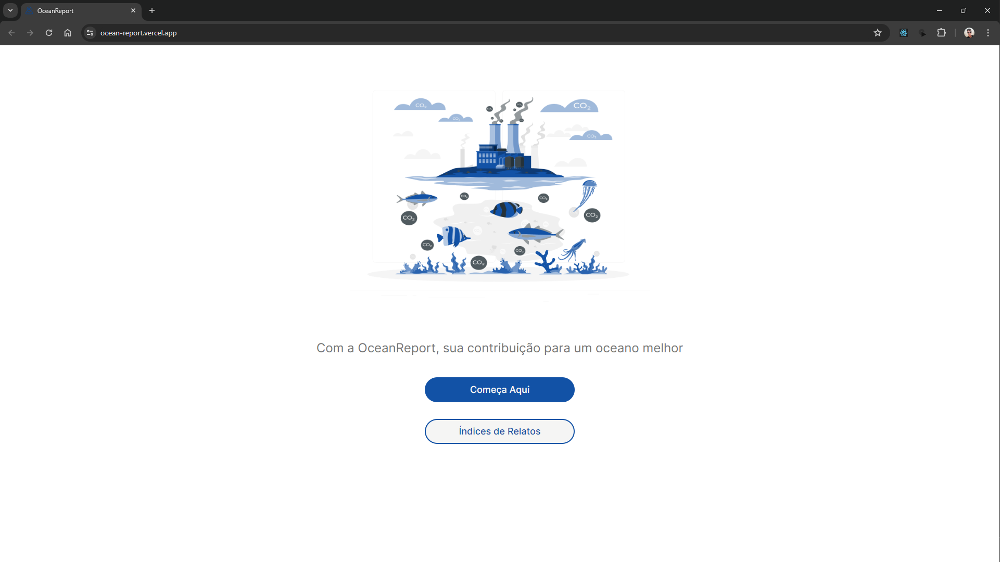

<div align="center" id="top"> 
  

&#xa0;

<a href="https://ocean-report.vercel.app/">Ocean Report</a>

</div>

<h1 align="center">Ocean report</h1>

<p align="center">
  

  

  

  

  <!--  -->

  <!--  -->

  <!--  -->
</p>

<!-- Status -->

<!-- <h4 align="center">
	🚧  Ocean report 🚀 Under construction...  🚧
</h4>

<hr> -->

<p align="center">
  <a href="#dart-explicação-do-projeto">Sobre</a> &#xa0; | &#xa0;
  <a href="#sparkles-justificativa-do-projeto">Justificativas</a> &#xa0; | &#xa0;
  <a href="#rocket-tecnologias">Tecnologias</a> &#xa0; | &#xa0;
  <a href="#arrow_up-deploy">Links do Deploy</a> &#xa0; | &#xa0;
  <a href="#white_check_mark-requerimentos">Requerimentos</a> &#xa0; | &#xa0;
  <a href="#checkered_flag-starting">Starting</a> &#xa0; | &#xa0;
  <a href="#memo-autores">Autores</a>
</p>

<br>

## :dart: Explicação do projeto

### Recursos Principais do App

#### 1. _Monitoramento e Relato de Problemas_

- _Envio de Relatos:_ Usuários podem enviar relatos sobre problemas observados nos oceanos, descrevendo sobre o acorrido.
- _Geolocalização Automática:_ O app registra automaticamente a localização GPS dos relatos.
- _Identificação do Estado:_ O sistema identifica o estado brasileiro correspondente às coordenadas GPS fornecidas.

#### 2. _Mapa Interativo de Problemas_

- _Visualização em Tempo Real:_ Um mapa interativo exibe todos os problemas relatados, permitindo que os usuários vejam áreas afetadas e planejem suas atividades.

#### 3. _Recursos Informativos_

- _Índice de relatos por estado:_ Visualização da quantidade de relatos por estado.

## :sparkles: Justificativa do projeto

### Importância dos Oceanos

Os oceanos são vitais para o clima, produção de oxigênio e biodiversidade. No entanto, estão ameaçados pela poluição, pesca excessiva e mudanças climáticas. Monitorar e relatar problemas é essencial para ações eficazes de conservação.

### Participação Comunitária

Envolver a comunidade é crucial para a preservação ambiental. Este projeto capacita cidadãos a relatar problemas, promovendo responsabilidade e cuidado com os oceanos.

### Benefícios Esperados

- [x] **Melhoria Ambiental:** Resolução rápida de problemas ambientais.
- [x] **Engajamento e Educação:** Aumento da conscientização e proatividade na conservação.
- [x] **Dados para Políticas Públicas:** Informações precisas para políticas eficazes de gestão ambiental.

### Conclusão

Este projeto capacita cidadãos para monitorar e relatar problemas nos oceanos, oferecendo educação ambiental e promovendo ações de conservação eficazes.

## :rocket: Tecnologias

### As seguintes ferramentas foram usadas neste projeto:

#### Web

- [React](https://react.dev/)
- [ViteJs](https://vitejs.dev/)
- [React Leaflet](https://react-leaflet.js.org/)
- [Tailwind CSS](https://tailwindcss.com/)
- [Shadcn/ui](https://ui.shadcn.com/)
- [React Router](https://reactrouter.com/en/main)
- [Lucide React](https://lucide.dev/)
- [Axios](https://axios-http.com/ptbr/)

#### Mobile

- [React](https://react.dev/)
- [React Native](https://reactnative.dev/)
- [Expo](https://expo.dev/)
- [Axios](https://axios-http.com/ptbr/)

#### Backend

- [Node](https://nodejs.org/en)
- [Fastify](https://fastify.dev/)
- [Typescript](https://www.typescriptlang.org/)
- [Prisma](https://www.prisma.io/)
- [Zod](https://zod.dev/)

## APIs utilizadas e suas funções.

Para documentação da API, acesse o link: [ocean-report-api](https://ocean-report-production.up.railway.app/docs)

## :arrow_up: Deploy

### Links do deploy (back e front) em funcionamento.

Front-end: [web](https://ocean-report.vercel.app/)
Front-end: [mobile](https://snack.expo.dev/@fernandavianasilva/f5189b)
Back-end: [api](https://ocean-report-production.up.railway.app)

## :white_check_mark: Requerimentos

Antes de starting :checkered_flag:, você precisa ter [Git](https://git-scm.com) e [Node](https://nodejs.org/en/) instalados.

## :checkered_flag: Starting

### Mobile

Somente pelo snack

### Web

```bash
# Clone this project
$ git clone https://github.com/lucasgomesoficial/ocean-report

# Access
$ cd ocean-report/web

# Install dependencies
$ npm i

# Run the project
$ npm run dev

# The server will initialize in the <http://localhost:3000>
```

### Backend

```bash
# Clone this project
$ git clone https://github.com/lucasgomesoficial/ocean-report

# Access
$ cd ocean-report/server

# Install dependencies
$ npm i

# Check Environment Variables
# Next starting your migrations
$ npx prisma migrate

# Run the project
$ npm run dev

# The server will initialize in the <http://localhost:3333>
```

## :memo: Autores

Made with :heart: by
<a href="https://github.com/lucasgomesoficial" target="_blank">Lucas Gomes</a> &#xa0; | &#xa0;
<a href="https://github.com/juliamiliano1" target="_blank">Julia de Souza Miliano</a> &#xa0; | &#xa0;
<a href="https://github.com/gabelvs" target="_blank">Gabriela Alves</a> &#xa0; | &#xa0;
<a href="https://github.com/flavianecandido" target="_blank">Flaviane Alves Cândido</a> &#xa0; | &#xa0;
<a href="https://github.com/fvdsilva" target="_blank">Fernanda Viana</a>

&#xa0;

<a href="#top">Back to top</a>
